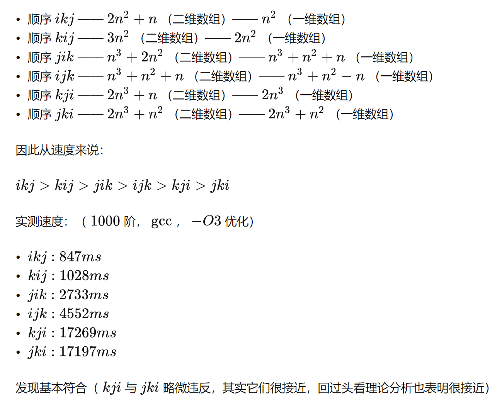
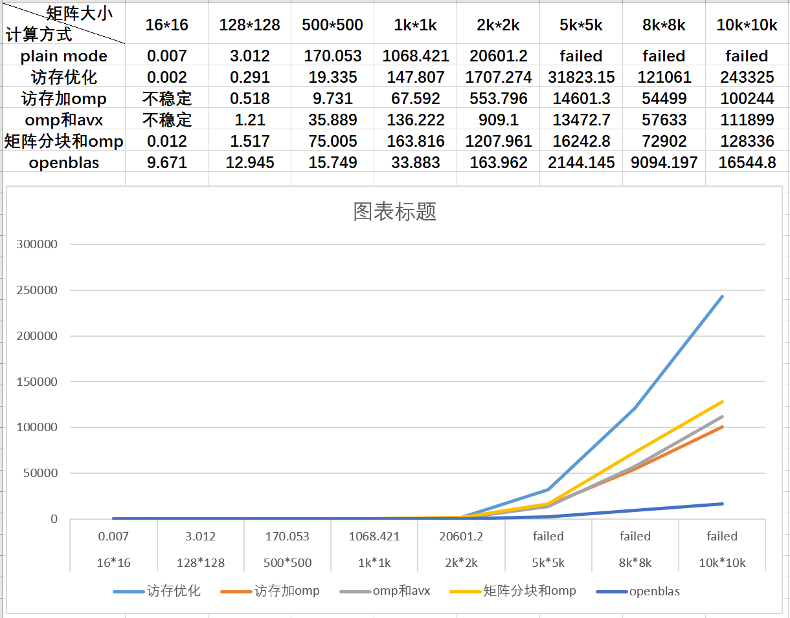

# CS205 C/ C++ Programming - Assignment4
Name: 高祖卿  
SID: 12112710
#Description
本次作业的要求是以上次作业完成的矩阵库为基础，对矩阵乘法做提升，并与OpenBLAS对比。
本次报告将由以下部分组成：
一、矩阵库的沿用与提升。
二、对矩阵乘法的分析及提升方法
三、各方法的测试及对比

#Part 1-矩阵库的沿用与提升
本次作业中，沿用了上次作业的矩阵结构,创建以及删除的方法，保留了参数检查的部分;保留了返回矩阵大小和打印矩阵的方法;并根据老师的指导，将Matrix::row和Matrix::col的类型改成了size_t。
```c
typedef struct
{
    size_t row;
    size_t col;
    float *data;
} Matrix;

Matrix *createMatrix_default(Matrix *matrix, size_t row, size_t col);               //声明一个m*n的矩阵并初始化为0
Matrix *createMatrix_initial(Matrix *matrix, size_t row, size_t col, float *array); //声明一个矩阵并用数组初始化
void valueMatrix_array(Matrix *matrix, float *array);                               //用数组给矩阵赋值
void valueMatrix_console(Matrix *matrix);                                           //用控制台给矩阵赋值
void deleteMatrix(Matrix **matrix);                                                 //删除一个矩阵 释放空间 指针置NULL
size_t sizeMatrix(Matrix *matrix);                                                  //返回矩阵的大小row*col
Matrix *matmul_plain(Matrix *matrix_left, Matrix *matrix_right);                    //朴素的矩阵相乘
Matrix *matmul_improved1(Matrix *matrix_left, Matrix *matrix_right);                //寻址优化
Matrix *matmul_improved2(Matrix *matrix_left, Matrix *matrix_right);                //寻址+openMP优化
Matrix *matmul_improved3(Matrix *matrix_left, Matrix *matrix_right);               // openMP+avx指令优化
Matrix *matmul_improved4(Matrix *matrix_left, Matrix *matrix_right);                 // 矩阵分块
void printMatrix(Matrix *matrix);                                                   //打印矩阵
```

#Part 2-矩阵乘法的分析及提升方法
在本次作业中，我们使用常规的矩阵乘法(参数检查部分省略)，如下所示，作为benchmark
```c
Matrix *matmul_plain(Matrix *matrix_left, Matrix *matrix_right)
{
        Matrix *matrix_product = createMatrix_default(matrix_product, matrix_left->row, matrix_right->col);
        size_t lrow = matrix_left->row;
        size_t lcol = matrix_left->col;
        size_t rcol = matrix_right->col;
        for (size_t i = 0; i < lrow; i++)
        {
            for (size_t j = 0; j < rcol; j++)
            {
                for (size_t k = 0; k < lcol; k++)
                {
                    matrix_product->data[i * matrix_product->col + j] += matrix_left->data[i * lcol + k] * matrix_right->data[k * rcol + j];
                }
            }
        }
        return matrix_product;
}

```
我们可以从以下几个方面来对矩阵乘法做提升：
1、编译器层面
2、内存访问方面
3、openMP和SIMD的使用
4.分块矩阵算法(cache的利用)

**1.编译器层面**
我们在使用gcc编译器运行程序时，都是基于O0（默认编译选项）进行的运行，并没有完全发挥gcc编译器的性能，我们可以增加一句代码来开启gcc的O3编译选项（最大限度的优化），通过增加编译代码的代码量来换取运行时间的大幅缩短。
```c
#pragma GCC optimize(3)
```

**2、内存访问方面**
>以下部分内容参考https://zhuanlan.zhihu.com/p/146250334

不管使用哪种方法，我们都需要对矩阵进行遍历，在矩阵库中，数据一般有两种储存方式：一维数组或二维数组。为了提升程序的速度，我们想在遍历数组时，尽量连续的访问内存，我们将从遍历顺序和储存方式两个方面来进行分析。
回到benchmark使用的方法，对于矩阵A*B，我们通过ijk的顺序进行遍历，最后得到矩阵C。我们假设AB都是方阵，行列数为n。
```c
for (size_t i = 0; i < lrow; i++)
        {
            for (size_t j = 0; j < rcol; j++)
            {
                for (size_t k = 0; k < lcol; k++)
                {
                    matrix_product->data[i * matrix_product->col + j] += matrix_left->data[i * lcol + k] * matrix_right->data[k * rcol + j];
                }
            }
        }
```
该方法是依次计算C中的每个元素。当计算C中任一个元素时，需要将A对应的行与B对应的列依次相乘相加。矩阵是按行存储的，所以在A相应行中不断向右移动时，内存访问是连续的。但B相应列不断向下移动时，内存访问是不连续的。计算完C的一个元素时，B相应列中已经间断地访问了n次，而A只间断1次（这一次就是算完后跳转回本行的开头），故总共是n+1次。这样计算完C中所有n^2 个元素，跳转了n^3 + n^2 次。加上C的跳转次数以后是n^3 +n^2 +n次。同时，如果储存方式为一维数组，那么还需要减去2n次跳转次数，也就是n^3 +n^2 -n次。
用同样的方式分析所有组合，我们可以得到如下数据：


因此，我们使用一维数组储存数据，并使用ikj的遍历顺序来尽量连续的访问内存以提升cache命中率，从而提升运算速度。方法实现如下：
```c
//访存优化
Matrix *matmul_improved1(Matrix *matrix_left, Matrix *matrix_right)
{
 
        Matrix *matrix_product = createMatrix_default(matrix_product, matrix_left->row, matrix_right->col);
        float r;
        size_t lrow = matrix_left->row;
        size_t lcol = matrix_left->col;
        size_t rcol = matrix_right->col;
        size_t rrow = matrix_right->row;
        for (size_t i = 0; i < lrow; i++)
        {
            for (size_t k = 0; k < rrow; k++)
            {
                r = matrix_left->data[i * lcol + k];
                for (size_t j = 0; j < rcol; j++)
                {
                    matrix_product->data[i * matrix_product->col + j] += (r * matrix_right->data[k * rcol + j]);
                }
            }
        }
        return matrix_product;
}
```

**3.openMP和SIMD的使用**
*1）openMP*
在进行矩阵运算时，如果碰到较大的矩阵，我们需要用到多次循环，为了减少循环次数，我们可以使用openMP让循环多线程并行，从而大幅减少运行时间，下列方法将访问内存和openMP结合进行了优化
```c

//访存优化+openMP优化
Matrix *matmul_improved2(Matrix *matrix_left, Matrix *matrix_right)
{
    
        Matrix *matrix_product = createMatrix_default(matrix_product, matrix_left->row, matrix_right->col);
        float r;
        size_t lrow = matrix_left->row;
        size_t lcol = matrix_left->col;
        size_t rcol = matrix_right->col;
        size_t rrow = matrix_right->row;
        // #pragma omp parallel for num_threads(32)
        #pragma omp parallel for schedule(dynamic)
        for (size_t i = 0; i < lrow; i++)
        {
            for (size_t k = 0; k < rrow; k++)
            {
                r = matrix_left->data[i * lcol + k];
                for (size_t j = 0; j < rcol; j++)
                {
                    matrix_product->data[i * matrix_product->col + j] += (r * matrix_right->data[k * rcol + j]);
                }
            }
        }
       return matrix_product;
 
}
```
可以看到，我们可以选择使用 
```c
#pragma omp parallel for num_threads(16)
或者
#pragma omp parallel for schedule(dynamic)
```
前者为固定16线程对循环进行拆分，后者为动态分配线程，根据实际测试，虽然固定16线程对于cpu的利用率更高，但在速度上却不如动态分配线程快，因此我们选择动态分配线程进行优化。

*2)SIMD指令集的应用*
SIMD(Single Instruction Multiple Data)即单指令流多数据流，也就是说我们可以利用一个指令来处理多个数据。
在以下方法中，我们使用avx2指令集，一次处理8个float数，再加上openMP的动态线程分配进行优化。

```c
// openMP+avx指令优化
Matrix *matmul_improved3(Matrix *matrix_left, Matrix *matrix_right)
{
        Matrix *matrix_product = createMatrix_default(matrix_product, matrix_left->row, matrix_right->col);
        size_t lrow = matrix_left->row;
        size_t lcol = matrix_left->col;
        size_t rcol = matrix_right->col;
        size_t rrow = matrix_right->row;
        size_t x = rcol / 8 * 8;
        if (x == rcol)
        {
            x -= 8;
        }
        __m256 value1, value2;
        __m256 beforeAdded, added, multiply;
        float cm;
//  #pragma omp parallel for num_threads(8)
#pragma omp parallel for schedule(dynamic)
        for (size_t i = 0; i < lrow; i++)
        {
            for (size_t k = 0; k < rrow; k++)
            {
                cm = matrix_left->data[i * lcol + k];
                if (cm == 0)
                {
                    continue;
                }
        value1[0] = cm;value1[1] = cm;value1[2] = cm;value1[3] = cm;   
        value1[4] = cm;value1[5] = cm;value1[6] = cm;value1[7] = cm;     
                
                
                for (size_t j = 0; j + 8 < rcol; j += 8)
                {
                    value2 = _mm256_loadu_ps(&matrix_right->data[k * rcol + j]);
                    multiply = _mm256_mul_ps(value1, value2);
                    beforeAdded = _mm256_loadu_ps(matrix_product->data + i * rcol + j);
                    added = _mm256_add_ps(beforeAdded, multiply);
                    _mm256_storeu_ps(matrix_product->data + i * rcol + j, added);
                }
                for (size_t j = x; j < rcol; j++)
                {
                    matrix_product->data[i * rcol + j] += matrix_left->data[i * lcol + k] * 
                                                          matrix_right->data[k * rcol + j];
                }
            }
        }
        return matrix_product;
}

```

**分块矩阵算法(cache的利用)**
>以下部分参考https://blog.csdn.net/weixin_40673608/article/details/88135041

benchmark中的方法在处理较大的矩阵时，矩阵无法全部装进缓存中，所以会导致高速缓存的缺失，因此，为了充分的利用高速缓存的局部性，我们将矩阵乘法分块实现，达到优化性能的作用。下列代码对于每种矩阵都选择了适合缓存大小的分块方式，同时利用openMP进行进一步加速。
```c
// 矩阵分块
Matrix *matmul_improved4(Matrix *matrix_left, Matrix *matrix_right)
{
        Matrix *matrix_product = createMatrix_default(matrix_product, matrix_left->row, matrix_right->col);
        size_t lrow = matrix_left->row;
        size_t lcol = matrix_left->col;
        size_t rcol = matrix_right->col;
        size_t rrow = matrix_right->row;
        size_t BLOCKSIZE = 0;
        float *A, *B, *C;
        size_t n = rcol;
        A = matrix_left->data;
        B = matrix_right->data;
        C = matrix_product->data;
       if(n<1000){BLOCKSIZE = n;}
    else{
        if (n%200 ==0){BLOCKSIZE=200;}
        else if(n%160 == 0){BLOCKSIZE=160;}
        else if(n%100 == 0){BLOCKSIZE=100;}
        else if (n%80 == 0){BLOCKSIZE =80;}
        else if(n%40 == 0){BLOCKSIZE = 40;}
        else if(n%32 == 0){BLOCKSIZE = 32;}
        else if(n%24 == 0){BLOCKSIZE = 24;}
        else if(n%16 == 0){BLOCKSIZE = 16;}
        else if(n%10 == 0){BLOCKSIZE = 10;}
        else if(n%8 == 0){BLOCKSIZE = 8;}
        else if (n%5 == 0){BLOCKSIZE = 5;}
        else if (n%3 == 0){BLOCKSIZE = 3;}
       else if(n%2==0){BLOCKSIZE = 2;}
       else {
           matmul_improved2(matrix_left,matrix_right);
            return;
       }
    }
        #pragma omp parallel for num_threads(8)
        for ( int sj = 0; sj < n; sj += BLOCKSIZE )
        #pragma omp parallel for num_threads(8)
        for ( int si = 0; si < n; si += BLOCKSIZE )
        #pragma omp parallel for num_threads(8)
        for ( int sk = 0; sk < n; sk += BLOCKSIZE )
        packMatrix(n, A+si*n+sk, B+sk*n+sj,  C+si*n+sj,BLOCKSIZE);
        A=NULL;  B=NULL; C=NULL;
        return matrix_product;
}

void packMatrix(int n, float *A, float *B, float *C,int BLOCKSIZE) {
    for(int i = 0; i < BLOCKSIZE; i++)
    {
        for(int j = 0; j < BLOCKSIZE; j++)
        {
            float cij = C[i*n+j];
            for(int k = 0; k < BLOCKSIZE; k++ ){
                if(BLOCKSIZE - k>=8){
                    __m256 r;
                    __m256 bt;
                    __m256 c0;
                    r = _mm256_loadu_ps(&A[i*n]+k);
                    bt = _mm256_loadu_ps(&B[j]+k*n);
                    c0 += r*bt;
                    cij += (c0[1]+c0[2]+c0[0]+c0[3]+c0[4]+c0[5]+c0[6]+c0[7]);
                    k+=7;
                    continue;
                }
                cij +=A[i*n+k] * B[k*n + j];
            }
            C[i*n+j] = cij;

        }

    }
}

```
#Part 3-各方法的测试和对比
对于以上的优化方法和OpenBLAS方法，我们都在不同的矩阵大小下进行了多次测试，最后取表现最好的三次取平均值，列出了以下图表

根据图表分析，我们可以看到，在矩阵很小时，优化后的方法并不比benchmark的方法好很多，甚至要差。并且使用了动态线程分配的两个方法所用的时间很不稳定（这是因为矩阵较小，动态线程分配每次都不同），但随着矩阵慢慢变大，优化后的方法开始与benchmark的方法有了较大的差距，其中表现最为突出的是访存优化+omp这一优化方法。
与OpenBLAs的对比：根据折线图，我们可以看出，一开始我们的方法与OpenBLAS差别并不大，但当矩阵变大。OpenBLAS的斜率变化依旧不大，而我们使用的方法斜率变化很大，证明我们和OpenBLAS还有一些差距（五倍左右），这是因为我们对于汇编方面的知识还不够，只是在算法和硬件方面进行了优化。
对于64k*64k的矩阵，因为受限于cpu内存，我们无法开出15g的内存，所以未能测试。

#Part 4-代码和结果
见https://github.com/Agouiscoding/cpppro4